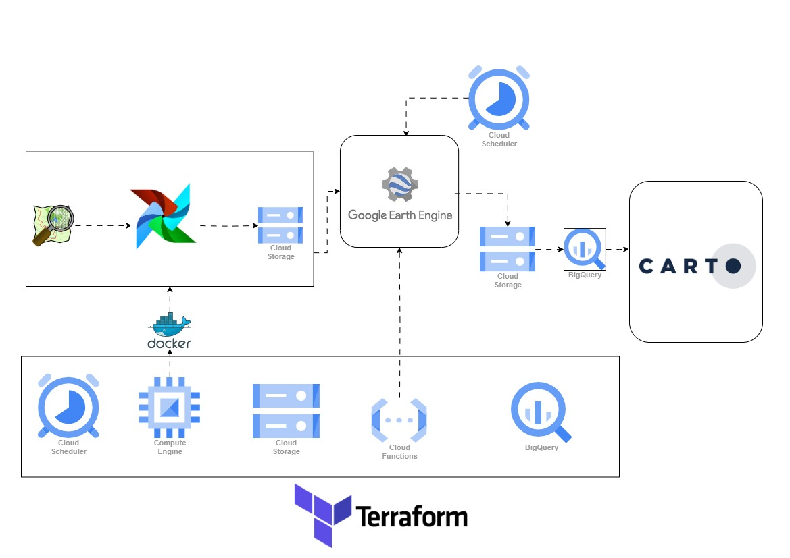

# FarmWatch: Monitoring Agricultural Lands with Satellite Imagery

## Pipeline Overview
FarmWatch is an innovative pipeline designed to monitor agricultural lands using satellite imagery and geospatial data processing. By leveraging OpenStreetMap (OSM) to extract all the updated farmland data, it then uses satellite imagery to extract vegetation indices, with updates every 5 days.

The process begins with the extraction and transformation of farmland data from OSM. Google Cloud Functions are then used to access the latest satellite imagery from the past 7 days. Using Google Earth Engine, key vegetation indices such as the Normalized Difference Vegetation Index (NDVI) and Normalized Difference Moisture Index (NDMI) are computed periodically. The data is securely stored in Google Cloud Storage for efficient management and retrieval.

Next, the processed data is modeled and analyzed using BigQuery. For visualization, FarmWatch incorporates Carto Dashboard, providing interactive spatial visualization capabilities that empower users to explore and interpret geospatial data effortlessly.

## Tools Required to Repeat This Project Step by Step
- **Google Compute Engine**: Provides scalable computing resources for efficient task execution.
- **Docker**: The Airflow used is run on Docker.
- **Airflow**: Orchestrates the workflow, automating task execution and scheduling.
- **Google Scheduler**: Automates when the function in Cloud Function works, built with Terraform.
- **Terraform**: Manages all the project infrastructure, creating resources such as BigQuery, Google Scheduler, Google Cloud Function, Google Cloud Storage, and Google Compute.
- **Google Cloud Function**: Automates the functions used to extract information from the satellite data.
- **BigQuery**: Queries and cleans the data stored on the Cloud Storage, creates a single table connected to the dashboard, and joins the farm information to the farm boundary.
- **Google Cloud Storage**: Stores all the extracted data, used as a staging area before the data are analyzed in the data warehouse (BigQuery).
- **Carto Dashboard**: A geospatial dashboard used to visualize the spatial data and information attached to it.
- **Google Earth Engine API**: A platform with terabytes of satellite data, the API functions get data from here and process satellite imagery, and compute key vegetation indices.

## Pipeline Architecture
1. **OSM Data**: Fetches farmland data from OSM to establish baseline information.
2. **Data Transformation and Enrichment**: Utilizes Airflow to clean and augment OSM data with administrative details for better analysis.
3. **Data Storage**: Stores processed data and satellite imagery in Google Cloud Storage for efficient retrieval and management.
4. **Satellite Imagery Acquisition**: Utilizes Google Earth Engine to acquire Sentinel satellite imagery for specified areas.
5. **NDVI and NDMI Calculation**: Computes NDVI and NDMI from satellite imagery to assess vegetation health and moisture levels.
6. **Zonal Statistics Calculation**: Determines average NDVI and NDMI values for each farmland polygon.
7. **Data Modeling**: Uploads enriched data to BigQuery for storage, querying, and modeling purposes.
8. **Dashboard Visualization**: Leverages Carto Dashboard to visualize spatial data and provide insights for monitoring agricultural lands.

## Architecture Diagram


## Dashboard


### Link to the Dashboard
Note: The Carto Dashboard expires after 14 days as it uses the free trial.
[FarmWatch Carto Dashboard](https://clausa.app.carto.com/map/262e9e12-4502-4415-ae4d-c8696a45dd00)

## How to Build the Application

### Folder Structure
```plaintext
airflow/
  - dag/
    - extract_file_data_from_osm.py
    - utils.py
  - docker-compose.yml
  - Dockerfile
gee/
  - get_farm_ndvi.py
  - get_farm_ndmi.py
  - utils.py
  - requirements.txt
terraform/
  - keys/
    - .json
  - main.tf
  - variables.tf
  - ndvi_function/ (local package)
    - main.py
  - ndmi_function/ (local package)
    - main.py
```

### Clone the Repository
```bash
git clone https://github.com/SammyGIS/zoomcamp-geospatial_engineering_project.git
```

## Key Components
- **Automated Data Processing**: Leveraging Airflow ensures timely execution of data processing steps.
- **Cloud-Based Storage and Compute**: Using Google Cloud Platform services enables scalable and cost-effective storage and computation.
- **Satellite Imagery Analysis**: Extracting NDVI and NDMI indices provides valuable insights into crop health and moisture levels.
- **Big Data Analytics**: BigQuery allows for efficient querying and analysis of large datasets.
- **Interactive Dashboard**: Carto Dashboard facilitates the visualization of spatial data, aiding in monitoring and decision-making.

## References
- [Deploy Cloud Functions on GCP with Terraform](https://medium.com/cloud-native-daily/deploy-cloud-functions-on-gcp-with-terraform-c6026be9d645)
- [Setup GCP Cloud Functions Triggering by Cloud Schedulers with Terraform](https://medium.com/geekculture/setup-gcp-cloud-functions-triggering-by-cloud-schedulers-with-terraform-1433fbf1abbe)
- [BigQuery Geospatial Data](https://cloud.google.com/bigquery/docs/geospatial-data)
- [Deploy and Configure Google Compute Engine VMs with Terraform](https://mihaibojin.medium.com/deploy-and-configure-google-compute-engine-vms-with-terraform-f6b708b226c1)
- [Using GeoJSON in BigQuery for Geospatial Analytics](https://id.cloud-ace.com/using-geojson-in-bigquery-for-geospatial-analytics/)
